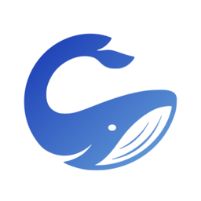

# Chromewhale

Codewhale in Chrome. A side panel that talks to the Codewhale runtime already
running on your machine, and five tools that let it read and act on the tab you
are looking at — one site at a time, only while the panel is open.

The extension is the client. Your agent, your models, your keys, and your
session history stay in the local runtime; nothing is relayed anywhere.

How it works and what it deliberately does not do:
[`docs/CHROME.md`](../../docs/CHROME.md).

## Install

Chromewhale is not on the Chrome Web Store yet. Load it unpacked:

1. Start the runtime:

   ```sh
   CODEWHALE_RUNTIME_TOKEN="$(openssl rand -hex 32)" codewhale app-server --http
   ```

2. Open `chrome://extensions`, turn on **Developer mode**, choose **Load
   unpacked**, and select this directory (`extensions/chrome`).
3. Click the Chromewhale toolbar button to open the side panel.
4. Open **Settings** in the panel and paste the same token. Host and port
   default to `127.0.0.1:7878`, matching `codewhale app-server --http`.

The status line turns to `Connected to Codewhale <version>` when the handshake
succeeds. If it says the runtime requires a token, the token in Settings does
not match `CODEWHALE_RUNTIME_TOKEN`.

## Use it

Ask about the tab you are on, or tell Chromewhale what to do in it:

- "What is this page actually claiming? Quote the parts that support it."
- "Fill the title and body of this issue form from my notes, but don't submit."
- "Open the docs for this error and tell me which section applies."

The first time a turn touches a site, the panel asks. Allowing grants Chrome's
own host permission for that origin and records the decision; the site then
appears under **Settings → Sites**, where **Forget** revokes both. **Pause**
stops every browser tool at once without disconnecting the chat.

## What it will not do

- Type into a password, one-time-code, or payment-card field. It refuses and
  says so; fill those yourself.
- Touch `chrome://` pages, extension pages, local files, or the Chrome Web
  Store.
- Act on any site you have not allowed, or on any site at all while paused or
  while the panel is closed.
- Enumerate or switch your tabs. It works on the active tab of the window the
  panel is open in, and nothing else.

Page text reaches the model wrapped in an explicit untrusted-content envelope,
because any page can try to talk to your agent. That reduces prompt injection;
it does not eliminate it. Grant sites the way you would grant a browser
extension — because that is exactly what you are doing.

## Develop

```sh
npm test    # node --test: policy, tool routing, page guards, SSE framing
```

No build step and no dependencies: Chrome loads the ES modules directly, and
the suites run the same files the browser does. Reload the extension from
`chrome://extensions` after an edit.
