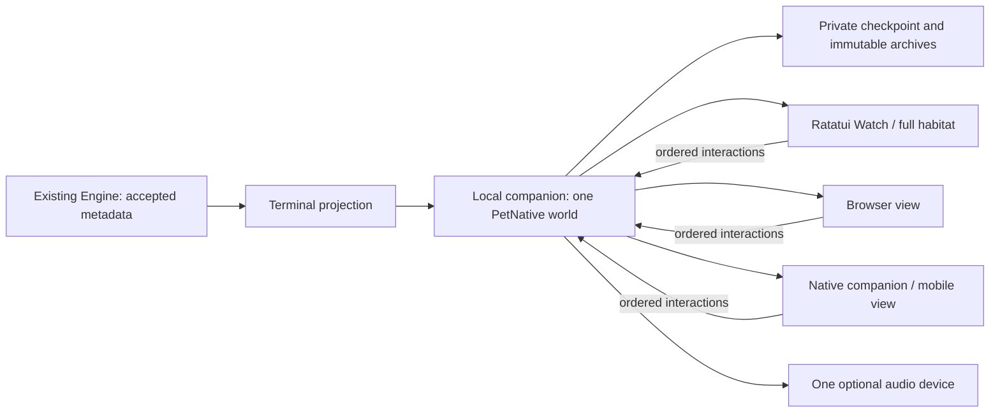

# One pet, attached views

`codewhale-tui pet serve` owns the local pet independently of every window.
Watch starts it when needed. The native macOS package can start its bundled
owner as well. Closing a view releases its connection; the companion keeps the
identity, clock, particle field and recording. It contains no agent turn loop,
prompts, provider calls or second telemetry classifier.



## Try it

From the repository root, build the existing product binary and native view:

```sh
npm --prefix pet ci --ignore-scripts
npm --prefix pet run sync
cargo build --locked -p codewhale-tui
PET_OWNER_BINARY="$PWD/target/debug/codewhale-tui" ./pet/macos/build.sh
./target/debug/codewhale-tui
```

In the running application:

| Command | Result |
| --- | --- |
| `/pet` | Toggle pet mode for this terminal: the habitat takes the whole content viewport now and on every accepted turn |
| `/pet on` / `/pet off` | Enable or disable explicitly; `off` closes the view and stops automatic entry while the companion keeps the pet alive |
| `/pet appearance` | Configure the shared palette in the authenticated local browser studio |
| `/pet window` | Open the independently closable native macOS window |
| `/pet source` | Explicitly select this terminal session as the source |
| `/pet sound on\|off` | Request/release the companion's audio device |
| `/pet export` | Save a replay to this saved session's artifacts |
| `/pet status` | Mode, view, identity and measured terminal output counters |

The pet has no workbar panel; the habitat is its only terminal view. Escape
leaves it without cancelling the turn or touching the composer draft. F6
toggles sound, F8 opens the appearance studio, and F9 opens the native window;
reduced motion follows the shell's existing motion setting. Hints and key
admission use the existing shell binding table. The habitat uses the modal
stack; composer contents, transcript, selection and active Engine state stay
underneath it. Consent and approval views retain their existing priority.

`CODEWHALE_PET_APP` can identify a locally built `.app`. `CODEWHALE_PET_HOME`
selects an isolated companion directory; its default is
`~/.codewhale/pet-shared`. `CODEWHALE_PET_PORT` chooses the initial loopback port
(default 4633; zero allocates an unused port for tests). A saved world retains
its selected port. `CODEWHALE_PET_GRAPHICS=braille` forces the text fallback.
None of these commands replace an installed global CLI.

## Appearance and work-to-result preview

The habitat studio provides Ocean, Chalk, Graphite, Linen, Forest, Plum, Ember
and Cobalt presets. Background, upper light, particle color, activity colors,
brightness, dot size, glow and environment are independently configurable.
Export/import a versioned appearance JSON. Live appearance changes use the same
ordered, durable action contract and reach every attached view; they never enter
the simulation's interaction journal or change its replay digest. Native and
terminal hosts consume the shared background, material, dot size and glow.

For an isolated, provider-free review, serve `pet/dist` and open
`shared.html?preview=1`. Compare all eight looks, toggle Still, and choose
**Preview work → result**. The canonical world drives the animation; the answer
is explicitly illustrative and no task or provider is run. The live studio's
preview detaches into an isolated world and offers **Return to live pet**.

`/pet on` is opt-in for the current TUI
instance. The existing Engine's accepted turn-start event opens the full habitat
when no consent or other modal owns focus. Completion gives space to the actual
last assistant/error cell through the existing transcript renderer, with arrows
and page keys for scrolling. The terminal implementation composes the whale above
the answer for legibility; the browser preview demonstrates an overlaid fade.
Escape does not cancel the turn, replace the composer or remove the transcript.
Conversation text stays in the shell, never in the pet transport or recording.

## Legible work and spontaneous motion

The shared frame adds a bounded, read-only `activity` projection. It reports
reading, searching, editing, command execution, tests, browser use, context
retrieval, response writing, coordination, errors and witnessed human waiting.
The exact printable tool identifier accompanies its label. An `exec_command`
receipt says **Running a command**: without inspecting its private arguments,
the pet cannot honestly call that a test, a build or a successful result.
At most four concurrent foreground cues and a fresh active-agent count are
projected. Tool/agent IDs, paths, arguments, prompts and outputs are omitted.
Cues expire after 800 ms without an appropriate heartbeat and clear on source
change, disconnect and restoration. A connected transport alone is not work.

The preview selector demonstrates thirteen action/unknown states. A complete
44-second work preview walks through eleven phases and then reveals the example
answer. Search sweeps, file marks, editing brackets, test activity rings and
parallel-agent marks use the canonical frame time, freeze under Still, and make
no claim about progress percentages, test counts or successful outcomes. These
extra drawn marks are currently a browser presentation treatment; terminal and
native prepared views share the exact action caption and canonical work forms.

Determinism and variety live at different boundaries:

* Physics, seven autonomous behaviors, persistent pod phases and sound use
  fixed ticks and named seeded streams. Rendering never consumes those streams.
* Engine observations and human interactions arrive from outside the pet.
  Accepted categories and ordered interactions are recorded. The same starting
  checkpoint and input history reproduce the motion and score.
* Changing the input history changes the visit. Focus and Pulse therefore
  influence a living trajectory while remaining replayable. Fresh worlds
  currently use the same initial seed; per-pet random birth seeds are not added.
* Live action captions are ephemeral receipts, intentionally absent from replay
  files to avoid persisting tool names. Replay proves the world and score, not a
  historical transcript of exact actions. It cannot revive a stale request.

The pet is a presentation of observed activity. It never chooses tools, invents
work, runs another agent loop, or blocks completion to finish an animation.

## Ownership and reconnects

A process-lifetime OS lock excludes a competing owner. Private, anchored file
I/O rejects symbolic/hard links, replaced locks and external revisions. The
saved envelope holds one UUID, connection credential, selected source and
revision, ordered cursor, retained interaction receipts and canonical recording.
The first attached saved terminal selects its session only when the source is
`unattached`. Later terminals are views until explicitly selected. Session IDs
are represented by a short SHA-256 identifier. Multiple sessions are never mixed.

Interactions require a client UUID, consecutive sequence and current source
revision. The world and receipt are saved before acknowledgement. Repeating the
same packet returns its receipt; changing a duplicate, skipping a sequence or
using a stale source fails. Storage failure refuses the action and preserves
the prior file. Receipts are retained for up to 4,096 interacting clients; they
are never silently evicted or re-applied after an owner restart.

Engine metadata uses a separate ordered producer lease and the existing
`PetEngineTelemetry` bucketer. A fresh lease starts with sequence zero and no
historical events. Unknown fields, content payloads, oversized batches and
partial invalid batches are rejected. Gaps reset observation, and old epochs
cannot feed a restarted owner. A heartbeat proves transport availability; it
cannot invent observed work. A witnessed waiting request still requires the
existing typed shell's current waiting state.

The world advances at fixed 30 Hz even with no views. Its periodic checkpoint
is once a second. Producer replies explicitly say `durable: false`: a crash
may lose the uncheckpointed observation interval. Acknowledged interactions
are durable. Recovery restores the last checkpoint and resumes at the first
unrecorded interval, clears producer/audio leases, and does not replay stale
sound or claim historical requests as current. Suspended-machine catch-up is
bounded to three ticks and marks a gap. Frame receivers independently reject
stale presentation after 800 ms.

At 1,024 consumed buckets or 4,096 applied interactions, completed history is
published immutably before the active segment advances. Active storage is
bounded to 8 MiB; recovery exports stream out of QuickJS in chunks, up to
64 MiB. Archives remain on disk and require explicit storage management.

## Graphics and audio

The Rust view worker polls immutable snapshots, interpolates display positions,
rasterizes and compresses pixels outside the input thread. It overwrites one
latest frame slot; it does not queue movies. The maximum raster is 960×560 RGB.
Stillness uses a separate stable projection and cannot change the authoritative
simulation, score, journal or digest. Missing coverage remains hollow and
labeled; sleep dims it separately.

Pixels require a successful Kitty graphics query and synchronized output.
Inline RGB uses zlib and base64 chunks of at most 4,096 bytes. One image ID per
process is replaced inside the existing Ratatui synchronized frame, with cursor
save/restore and deletion on layout changes, covered views and exit. The
transport follows the [Kitty graphics protocol](https://sw.kovidgoyal.net/kitty/graphics-protocol/).

60 fps is a presentation target, not a universal guarantee. `/pet
status` reports actual frames, elapsed output time, bytes/second, raster time
and write time for that visit. Slow encoding drops intermediate presentations.
The 30 Hz world does not depend on display rate. Unsupported terminals, tmux,
Sixel-only terminals and disabled synchronized output use braille. SSH can use
inline Kitty bytes if the remote terminal answers the probe, but bandwidth and
end-to-end SSH compatibility require separate measurement. No tmux passthrough
or Sixel pixel renderer is claimed.

Sound is off by default. One view leases the companion's single `ffplay`
output, renewed every 500 ms and expired after two seconds. PCM comes from the
existing deterministic score at 48 kHz. Closing, hiding, quiet mode and stale
frames release or expire the lease. Late output is dropped through the bounded
PCM queue. FFmpeg is optional and never downloaded automatically. On mobile,
“Companion sound” controls the owner's speaker; it does not start a second
phone player.

## Existing habitats and mobile

Wild, Event demo, imported replay and File study remain explicitly isolated.
Old browser IndexedDB recordings and per-session TUI
`artifacts/pet/habitat.json` files are retained. Apple File study continues to
use the former `live.json`; Android's File study keeps its `live` storage key.
Shared views never overwrite or merge those worlds. Import their recordings in
the standalone viewer to recover them.

The local browser can join using its “Join shared pet” file control and the
private `connection.json`, or the terminal's browser command. The URL fragment
is removed immediately; the owner exchanges the bearer for an HttpOnly,
SameSite cookie. Host and Origin checks reject foreign origins. The listener is
only `127.0.0.1`; no CORS, LAN listener or unauthenticated remote route is added.

Apple and Android Shared modes consume the same immutable frame contract.
They do not run their native simulation or native audio in this mode. Import
`connection.json` with “Join shared pet”; it is retained privately. On an Android
emulator or explicitly connected device, `adb reverse tcp:4633 tcp:4633` carries
its loopback traffic to the desktop owner. iOS Simulator shares host loopback.
Physical-device/cross-network use needs an explicitly established authenticated
loopback tunnel. The existing Runtime's authenticated transport and progress
contract are unchanged; no new remote deployment or compatibility claim is made.

## Verification

`python3 pet/scripts/check-shared.py /absolute/path/to/codewhale-tui` creates a
unique fixture directory and checks owner exclusion, two attachments, metadata
validation, source changes, interaction ordering, view independence, audio
exclusion, crash recovery and storage conflicts. Fixtures are retained for
inspection. `npm --prefix pet run check` covers unchanged replay/score semantics
and presentation immutability. The product's `pet_watch` tests exercise real
transport encoding, braille, focus restoration, storage and PCM boundaries.

Build/test receipts, actual native/browser screenshots, terminal visual
qualification and independent exact-SHA review are separate evidence. See
`QA.md` for the current measured results and outstanding limitations.
